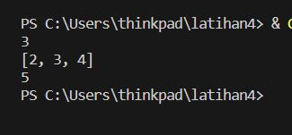
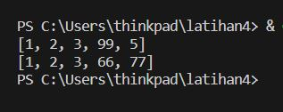
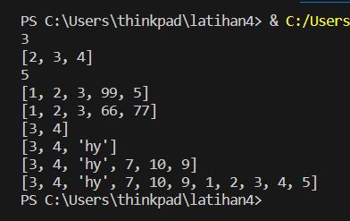
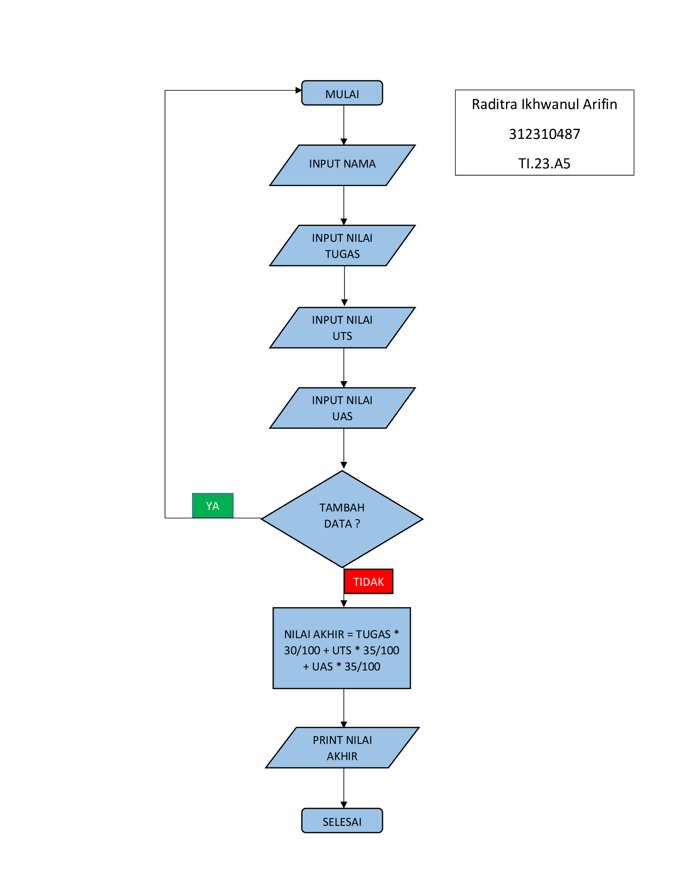

# Latihan 9 Bahasa Pemrograman
## Buat sebuah list sebanyak 5 elemen dengan nilai bebas
### Akses list:
* Tampilkan elemen ke 3
* Ambil nilai elemen ke 2 sampai elemen ke 4
* Ambil elemen terakhir

## Programnya
``````python
# Buat sebuah list sebanyak 5 elemen dengan nilai bebas
my_list = [1, 2, 3, 4, 5]
# Tampilkan elemen ke 3
print(my_list[2])
#  Ambil nilai elemen ke 2 sampai elemen ke 4
print(my_list[1:4])
# Ambil elemen terakhir
print(my_list[-1])

``````
### Outputnya:



### Ubah elemen list:
* Ubah elemen ke 4 dengan nilai lainnya
* Ubah elemen ke 4 sampai dengan elemen terakhir

## Programnya
``````python
my_list = [1, 2, 3, 4, 5]
# Ubah elemen ke 4 dengan nilai lainnya
my_list[3] = 99
print(my_list)
#  Ubah elemen ke 4 sampai dengan elemen terakhir
my_list[3:] = [66, 77]
print(my_list)
``````
### Outputnya:



### Tambah elemen list:
* Ambil 2 bagian dari list pertama (A) dan jadikan list ke 2 (B)
* Tambah list B dengan nilai string
* Tambah list B dengan 3 nilai
* Gabungkan list B dengan list A

## Programnya
``````python
listA = [1, 2, 3, 4, 5]
# Ambil 2 bagian dari list pertama (A) dan jadikan list ke 2 (B)
listB = listA[2:4]
print(listB)
# Tambah list B dengan nilai string
listB.append("hy")
print(listB)
# Tambah list B dengan 3 nilai
listB.extend([7, 10, 9])
print(listB)
# Gabungkan list B dengan list A
gabungkan_list = listB + listA
print(gabungkan_list)
``````
### Outputnya :


### Output dari semua latihan diatas:



# Praktikum 4 Bahasa Pemrograman
## Buat program sederhana untuk menambahkan data kedalam sebuah list dengan rincian sebagai berikut:
* Progam meminta memasukkan data sebanyak-banyaknya (gunakan perulangan)
* Tampilkan pertanyaan untuk menambah data (y/t?), apabila jawaban t (Tidak), maka program akan menampilkan daftar datanya.
* Nilai Akhir diambil dari perhitungan 3 komponen nilai (tugas: 30%, uts: 35%, uas: 35%)
* Buat flowchart dan penjelasan programnya pada README.md.

## Flowchartnya:



## Programnya:
``````python
# LIST
nama = []
nim = []
nilaiTugas = []
nilaiUTS = []
nilaiUAS = []
nilaiAkhir = []

print()

# Input
while True:
    nama.append(input("Masukan Nama : "))
    nim.append(input("Masukan NIM  : "))
    Tugas = int(input("Nilai Tugas  : ")); 
    nilaiTugas.append(Tugas)
    UTS   = int(input("Nilai UTS    : ")); 
    nilaiUTS.append(UTS)
    UAS   = int(input("Nilai UAS    : ")); 
    nilaiUAS.append(UAS)

    nilaiAkhir.append(Tugas * 30/100 + UTS * 35/100 + UAS * 35/100)

    print()
    _tanya = input("Tambah data ? [y/t]: ")
    print()
    if(_tanya == "t"):
        break

# Output
print("+----+-----------------------+--------+--------+-------+-------+---------+")
print("| {0:^2} | {1:^18} | {2:^9} | {3:^6} | {4:^5} | {5:^5} | {6:^7} |".format("No", "Nama", "NIM", "Tugas", "UTS", "UAS", "Akhir"))
print("-----+-----------------------+--------+--------+-------+-------+---------+")

no = 0
for nama, nim, Tugas, UTS, UAS, nilaiAkhir in zip(nama, nim, nilaiTugas, nilaiUTS, nilaiUAS, nilaiAkhir):
    no += 1    
    print("| {0:>2} | {1:<18} | {2:>8} | {3:>6} | {4:>5} | {5:>5} | {6:>7} |".format(no, nama, nim, Tugas, UTS, UAS, nilaiAkhir))
print("+----+-----------------------+--------+--------+-------+-------+---------+")
``````
### Outputnya:


