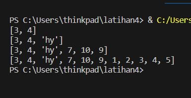

# Latihan 9 Bahasa Pemrograman
## Buat sebuah list sebanyak 5 elemen dengan nilai bebas
### Akses list:
* Tampilkan elemen ke 3
* Ambil nilai elemen ke 2 sampai elemen ke 4
* Ambil elemen terakhir

## Programnya
``````python
# Buat sebuah list sebanyak 5 elemen dengan nilai bebas
my_list = [1, 2, 3, 4, 5]
# Tampilkan elemen ke 3
print(my_list[2])
#  Ambil nilai elemen ke 2 sampai elemen ke 4
print(my_list[1:4])
# Ambil elemen terakhir
print(my_list[-1])

``````
### Outputnya:


### Ubah elemen list:
* Ubah elemen ke 4 dengan nilai lainnya
* Ubah elemen ke 4 sampai dengan elemen terakhir

## Programnya
``````python
my_list = [1, 2, 3, 4, 5]
# Ubah elemen ke 4 dengan nilai lainnya
my_list[3] = 99
print(my_list)
#  Ubah elemen ke 4 sampai dengan elemen terakhir
my_list[3:] = [66, 77]
print(my_list)
``````
### Outputnya:


### Tambah elemen list:
* Ambil 2 bagian dari list pertama (A) dan jadikan list ke 2 (B)
* Tambah list B dengan nilai string
* Tambah list B dengan 3 nilai
* Gabungkan list B dengan list A

## Programnya
``````python
listA = [1, 2, 3, 4, 5]
# Ambil 2 bagian dari list pertama (A) dan jadikan list ke 2 (B)
listB = listA[2:4]
print(listB)
# Tambah list B dengan nilai string
listB.append("hy")
print(listB)
# Tambah list B dengan 3 nilai
listB.extend([7, 10, 9])
print(listB)
# Gabungkan list B dengan list A
gabungkan_list = listB + listA
print(gabungkan_list)
``````
### Outputnya :



### Output dari semua latihan diatas:

